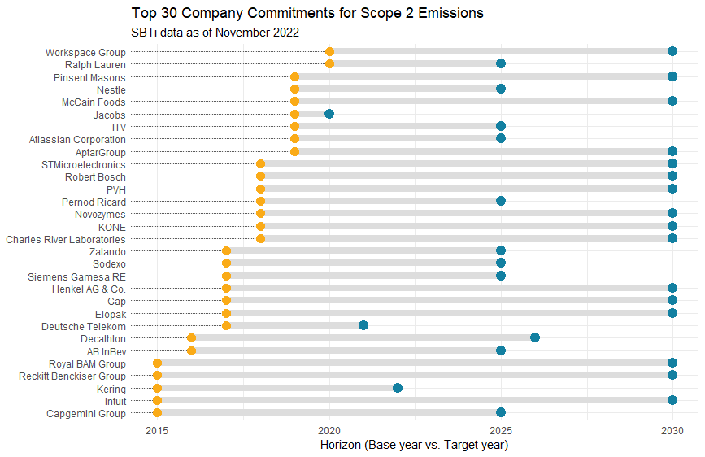

# How Ambitious are Company Scope-2 Emissions Reduction Targets?

Reviewing SBTi data extracted from the SBTi Progress Report 2021 Appendix Data

Source: https://sciencebasedtargets.org/reports/sbti-progress-report-2021

Note - to recreate this subset of data, I filtered the following parameters: (i) Target = 1 which is "100% of emissions reduction, share of renewable energy or supplier engagement company aims to achieve." (ii) Organisation type = Company (iii) Target scope = Scope 2 (iv) Target type = Renewable electricity

  

Performance:
- 40% of the 30 companies selected are falling behind on their scope 2 emissions conversion to renewables
- On average: those 40% of companies that are falling behind are doing so by 19%, or will exceed their own deadline by 1.5 years 
- 40% of the 30 companies selected are on track or ahead of their scope 2 emissions conversion to renewables
- On average: those 40% of companies that are on track are ahead of schedule by 25%, or may complete their targets 2.75 years earlier than planned

Sectors:
- Of the 11 possible major GIC sectors, only the Energy sector is missing, all other sectors make at least one appearance
- Consumer Staples is by far the most represented sector per the time of writing, followed by the Consumer Discretionary sector
- I Expected the Utilities sector to have a high prevalence in this selection criteria, surprised to only see one company?
- Real Estate, despite being exposed to a lot of climate-related transition risk, does not make much of an appearance, disappointing
